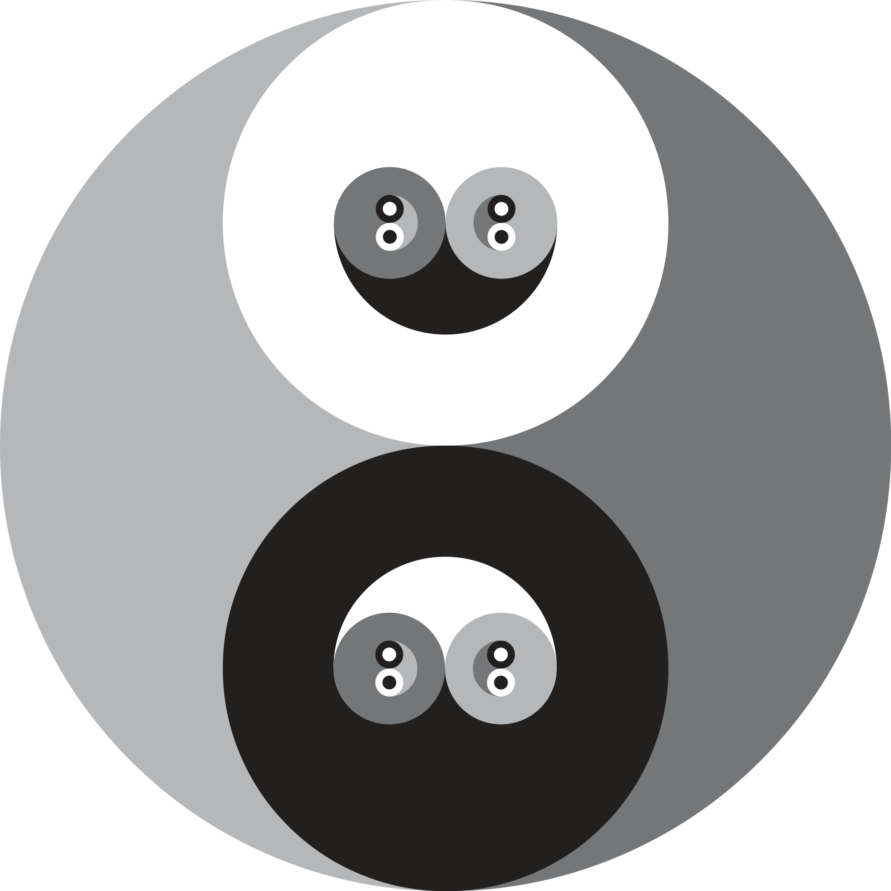

<p align="center">
  <a href="https://liberapay.com/pellaDev/donate">
    
  </a>
</p>

<h1 align="center">
  PDS - Pella Design System
</h1>

<div align="center">
  
</div>

<h2 align="center">
  A Plug & Play React design system
</h2>

<div align="center">
  <a href="https://pds.pellawebmaster.com" target="_blank" rel="noopener"></a>
</div>

<div align="center">
  
</div>

<div align="center">
  <sub>(coming soon..)</sub>
</div>

## Install

```bash
pnpm add "https://github.com/pellaDev/PDS#main"
```

That's it. No config, no Vite plugin, no postcss setup — the CSS is pre-compiled and ships with the package.

Pin a release instead of tracking `main`:

```bash
pnpm add "https://github.com/pellaDev/PDS#v1.9.0"
```

## Optional dependencies

Most components have no extra requirements. Five components use an **optional
peer dependency** that you only need if you use that component:

| Component | Extra package | Install |
| --- | --- | --- |
| `chart` | `recharts` | `pnpm add recharts` |
| `carousel` | `embla-carousel-react` | `pnpm add embla-carousel-react` |
| `drawer` | `vaul` | `pnpm add vaul` |
| `command` | `cmdk` | `pnpm add cmdk` |
| `sonner` | `sonner` | `pnpm add sonner` |

PDS installs without them; the peer is optional by design (declared in
`peerDependenciesMeta`). `framer-motion` is no longer required by PDS at all —
it was removed in v1.5.0 as an unused dependency.

## Update / revert

Inside a clone of this repository, `update.mjs` moves the installation to any
released version — upgrade or roll back at will:

```bash
node update.mjs --1.3.1      # that exact release (the "--" is optional)
node update.mjs --latest     # newest release, pre-releases included
node update.mjs --stable     # newest stable (non-prerelease) release
```

`--latest`/`--stable` are resolved through the GitHub Releases API (public repo,
no token needed); exact versions resolve against git tags. A dirty working tree
aborts the update unless you pass `--force` (discards local changes). When
`pnpm-lock.yaml` and pnpm are available, dependencies are reinstalled after the
checkout.

## Usage

```tsx
import "@workspace/pds/styles.css";
import { Button } from "@workspace/pds/components/ui/button";
import { tokens } from "@workspace/pds/tokens";

export function App() {
  return <Button>Save</Button>;
}
```

### Configuration (optional)

```tsx
import { configurePds, setPdsConfig, usePdsConfig } from "@workspace/pds/config";

configurePds({ lightBrand: "#0B5FFF", darkBrand: "#7AB8FF", font: "inter" });
setPdsConfig({ fieldStyle: "outline" });
```

| Option | Values | Default |
| --- | --- | --- |
| Brand colors | `lightBrand` / `darkBrand` — hex | exported brand primaries |
| Field style | `"fill"` or `"outline"` | `"fill"` |
| Font | self-hosted typeface name from tokens | `roboto` |

## Exports

| Subpath | Content |
| --- | --- |
| `@workspace/pds` / `/tokens` | Generated token values + types |
| `@workspace/pds/styles.css` | Generated CSS theme |
| `@workspace/pds/config` | Runtime configuration (brand, font, field style) |
| `@workspace/pds/components/*` | UI components |
| `@workspace/pds/lib/*` | Shared utilities |
| `@workspace/pds/hooks/*` | Shared hooks |

## Requirements

- Node v22+, pnpm 10
- React >= 18 (peer dependency)
